# ECOTRACK - Document d'implementation

Date de production : 14 juin 2026  
Projet : plateforme intelligente de gestion des dechets urbains  
Perimetre observe : depot source, documentation existante, environnement local en execution, parcours UX par role

---

## 1. Objet du document

Ce document presente de maniere concrete :

- ce qui a ete implemente dans ECOTRACK ;
- comment cela a ete implemente techniquement ;
- comment les briques frontend, backend, base de donnees et IoT collaborent ;
- comment les parcours utilisateurs s'enchainent selon le role ;
- quel backlog a porte la livraison et quelles suites sont recommandees.

Le contenu s'appuie sur :

- la structure reelle du projet ;
- les documents de suivi deja presents dans `dev-docs/` ;
- l'application lancee localement sur `http://localhost:5173` et `http://localhost:8000` ;
- des captures UX prises sur l'interface reelle ;
- des visuels backlog et architecture produits pour professionnaliser la restitution.

---

## 2. Synthese executive

ECOTRACK est aujourd'hui un prototype fonctionnel de gestion des dechets urbains, structure autour d'une SPA React, d'une API FastAPI, d'une base PostgreSQL/PostGIS et d'un simulateur IoT communiquant via MQTT.

Le projet couvre deja la chaine metier principale :

- authentification et gestion des roles ;
- visualisation du parc de conteneurs ;
- gestion des signalements citoyens ;
- traitement IoT et alertes ;
- planification et execution des tournees ;
- tableaux de bord analytics ;
- administration et audit.

### Chiffres clefs observes

| Indicateur | Valeur constatee |
|---|---:|
| Modules API `backend/app/api/v1` | 12 |
| Services backend `backend/app/services` | 17 |
| Fichiers de pages frontend `frontend/src/pages` | 24 |
| Paths OpenAPI | 38 |
| Operations API documentees | 47 |
| Schemas OpenAPI | 49 |
| Tests backend recenses | 96 |
| Tests frontend verts | 11 |
| Roles applicatifs | 4 |

### Roles metier supportes

| Role | Usage principal |
|---|---|
| Citoyen | consulter la carte, signaler un probleme, suivre ses points |
| Agent | executer une tournee, remonter les incidents terrain |
| Manager | piloter le parc, les tournees, les KPI et les alertes |
| Admin | administrer les utilisateurs et auditer les actions |

---

## 3. Vue d'ensemble de l'architecture

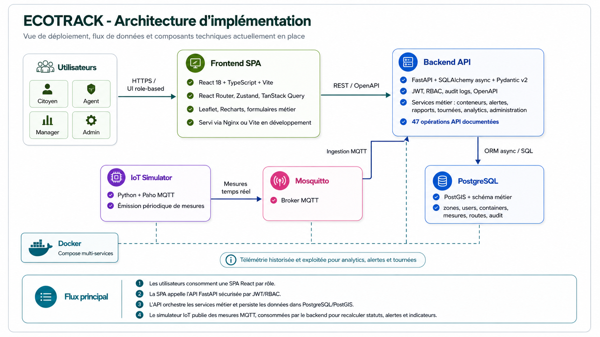

### 3.1 Composition technique

| Brique | Stack | Role |
|---|---|---|
| Frontend | React 18, TypeScript, Vite, React Router, Zustand, TanStack Query, Leaflet, Recharts | interface web role-based |
| Backend | FastAPI, SQLAlchemy async, Pydantic v2, JWT, OpenAPI | logique metier, securite, orchestration |
| Base de donnees | PostgreSQL 15 + PostGIS | stockage metier, geolocalisation et historique |
| IoT | Mosquitto + simulateur Python | emission de mesures temps reel |
| Conteneurisation | Docker Compose | orchestration locale des services |

### 3.2 Flux de fonctionnement

1. L'utilisateur se connecte a la SPA.
2. Le frontend determine le role, applique les gardes de navigation et charge les ecrans adaptes.
3. Les actions utilisateur appellent l'API `/api/v1`.
4. L'API applique JWT, RBAC, validation, services metier et audit.
5. Les donnees sont lues ou ecrites dans PostgreSQL/PostGIS.
6. En parallele, le simulateur IoT publie des mesures sur MQTT.
7. Le backend consomme ces mesures pour recalculer les statuts, generer des alertes et alimenter les KPI.

---

## 4. Ce qui a ete mis en place

## 4.1 Infrastructure et execution locale

Les points d'entree observes dans le projet sont :

- frontend : `http://localhost:5173`
- backend : `http://localhost:8000`
- Swagger : `http://localhost:8000/docs`
- broker MQTT : port `1883`
- PostgreSQL/PostGIS : port `5433`

Les services sont orchestras via `docker-compose.yml` :

- `postgres`
- `mosquitto`
- `backend`
- `frontend`
- `iot-simulator`

Le projet dispose aussi d'un override de developpement avec `docker-compose.dev.yml`.

## 4.2 Backend metier

Le backend est structure par domaines fonctionnels. Les principaux modules exposes dans `backend/app/api/v1/` couvrent :

- `auth`
- `users`
- `zones`
- `containers`
- `reports`
- `routes`
- `route-steps`
- `alerts`
- `analytics`
- `iot`
- `audit-logs`

### Capacites backend deja presentes

| Domaine | Capacites constatees |
|---|---|
| Auth | register, login, refresh, me |
| Securite | JWT access/refresh, RBAC, rate limit, headers de securite |
| Parc | CRUD conteneurs, zones, vues carte, historique de mesures |
| IoT | ingestion MQTT, moteur de statut, alertes |
| Citoyen | signalements, anti-doublon, gamification |
| Operationnel | tournees, affectation agent, validation d'etapes |
| Pilotage | KPI dashboard, analytics, prediction simple |
| Administration | users admin, audit logs, exports |

### Ce qui a ete mis en place concretement cote backend

Le backend n'a pas ete concu comme un simple point d'entree CRUD. Il implemente une logique metier structuree en plusieurs couches :

- couche API FastAPI pour exposer les endpoints REST ;
- couche schemas Pydantic pour valider les payloads ;
- couche services pour porter les regles fonctionnelles ;
- couche persistence SQLAlchemy/PostGIS pour les objets metier et les requetes spatiales ;
- couche middleware pour l'authentification et les controles RBAC.

Concretement, les briques suivantes ont ete livrees :

- authentification JWT avec access token et refresh token ;
- gestion fine des roles `CITIZEN`, `AGENT`, `MANAGER`, `ADMIN` ;
- protection des routes sensibles ;
- calcul du statut d'un conteneur a partir des mesures et des signalements ;
- ingestion de mesures IoT via MQTT ;
- creation de signalements avec anti-doublon ;
- attribution de points citoyens ;
- creation, affectation et execution de tournees ;
- calcul d'indicateurs de pilotage et vues analytics ;
- journalisation des actions d'administration et de securite.

### Comment cela a ete mis en place cote backend

Le decoupage du code montre une implementation pragmatique :

- `backend/app/api/v1/*.py` expose le contrat HTTP ;
- `backend/app/services/*.py` porte les comportements metier ;
- `backend/app/models/*.py` decrit le schema persistant ;
- `backend/app/schemas/*.py` formalise les entrees/sorties ;
- `backend/app/core/*.py` centralise la configuration, la securite et le logging.

Quelques exemples representatifs :

- `auth.py` orchestre `register`, `login`, `refresh` et `me` ;
- `iot_ingest.py` persiste une mesure puis recalcule le statut du conteneur ;
- `report_service.py` applique l'anti-doublon, recalcule le statut et alimente la gamification ;
- `route_service.py` filtre les conteneurs critiques, appelle l'optimiseur puis construit les etapes de tournee ;
- `analytics_service.py` exploite des requetes SQL agragees pour alimenter directement le dashboard et les graphiques.

## 4.3 Frontend role-based

Le frontend repose sur un routage clair par role avec redirections automatiques :

| Role | Redirection racine |
|---|---|
| CITIZEN | `/map` |
| AGENT | `/my-tours` |
| MANAGER | `/dashboard` |
| ADMIN | `/dashboard` |

Les pages observees couvrent :

- auth : connexion, inscription
- carte / parc : carte, liste, detail conteneur
- citoyen : nouveau signalement, profil
- agent : mes tournees, detail tournee
- manager : dashboard, conteneurs, tournees, analytics
- admin : utilisateurs, audit logs

### Ce qui a ete mis en place concretement cote frontend

Le frontend materialise plusieurs experiences distinctes dans une seule SPA :

- une experience citoyenne centree sur la carte, le signalement et le profil ;
- une experience agent mobile-first centree sur la tournee du jour ;
- une experience manager orientee supervision, parc et planification ;
- une experience admin orientee gouvernance et tracabilite.

Concretement, l'interface fournit :

- un layout applicatif avec sidebar filtree par role ;
- une redirection automatique apres connexion ;
- des gardes d'acces sur chaque page ;
- une carte Leaflet avec recherche, filtres, popups et navigation metier ;
- des vues de dashboard alimentees par des endpoints analytics ;
- des formulaires de creation et de traitement d'objets metier ;
- un parcours mobile terrain pour l'agent ;
- un backoffice d'administration pour les utilisateurs et les journaux d'audit.

### Comment cela a ete mis en place cote frontend

L'implementation frontend repose sur des decisions structurantes :

- React Router pour les pages et la segregation par role ;
- Zustand pour la session utilisateur ;
- TanStack Query pour la recuperation et l'invalidation des donnees serveur ;
- Axios pour les appels API ;
- Leaflet pour la carte du parc ;
- Recharts pour les KPI et graphiques ;
- des pages specialisees par domaine metier dans `frontend/src/pages`.

Le resultat est une interface qui ne se contente pas d'afficher des donnees brutes : elle traduit directement les scenarios d'usage du projet.

## 4.4 Donnees geospatiales et IoT

Le projet ne se limite pas a du CRUD classique :

- les zones sont gerees dans PostGIS ;
- les conteneurs sont relies a une logique de position ;
- les mesures de remplissage sont historisees ;
- les statuts `NORMAL`, `WATCH`, `CRITICAL`, `MAINTENANCE`, `UNKNOWN` sont exploites a la fois sur la carte et dans les KPI ;
- les alertes et les tournees s'appuient directement sur ces donnees.

## 4.5 Qualite et testabilite

Le depot contient deja :

- un plan de tests par role dans `dev-docs/TEST_USERFLOW.md` ;
- un suivi backend indiquant 96 tests recenses ;
- un suivi frontend indiquant 11 tests unitaires verts ;
- une specification OpenAPI exportee dans `docs/api/openapi.yaml`.

---

## 5. Comment l'implementation a ete realisee

## 5.1 Authentification et autorisation

L'authentification repose sur un couple frontend/backend clairement separe :

- le frontend persiste la session dans un store Zustand ;
- le backend emet des tokens JWT ;
- le role est injecte dans la navigation et les gardes d'acces ;
- les routes sensibles sont revalidees cote serveur via RBAC.

### Fichiers cles

| Cote | Fichiers |
|---|---|
| Frontend | `frontend/src/store/auth.ts`, `frontend/src/hooks/useAuth.ts`, `frontend/src/router/index.tsx`, `frontend/src/components/layout/ProtectedRoute.tsx` |
| Backend | `backend/app/api/v1/auth.py`, `backend/app/middleware/auth.py`, `backend/app/core/security.py`, `backend/app/services/auth_service.py` |

### Resultat fonctionnel

- login multi-role ;
- inscription citoyen ;
- persistance de session ;
- protection des ecrans ;
- redirection differenciee selon le role.

## 5.1.1 Mise en place cote frontend

La session frontend repose sur `useAuthStore` et `useAuth`, avec persistance locale de :

- l'access token ;
- le refresh token ;
- l'utilisateur courant.

Le routeur principal applique ensuite :

- une redirection par role des l'arrivee sur `/` ;
- des `ProtectedRoute` sur chaque espace fonctionnel ;
- un `AppShell` unique qui porte la sidebar, le header et la navigation contextuelle.

Cela permet d'avoir une seule base d'interface pour quatre experiences metier distinctes.

## 5.1.2 Mise en place cote backend

Le backend s'appuie sur :

- `auth.py` pour les endpoints publics et prives ;
- `security.py` pour la generation et la verification des JWT ;
- `middleware/auth.py` pour l'identite courante et le RBAC ;
- `audit_service.py` pour tracer les succes et echecs de connexion.

Le resultat est une authentification complete, exploitable a la fois par l'interface et par la documentation API.

## 5.2 Gestion du parc et cartographie

La carte est une brique centrale du produit. Elle est implemente via :

- React Leaflet cote frontend ;
- endpoints de restitution du parc cote backend ;
- donnees geospatiales PostGIS pour les zones ;
- statuts couleur derives des mesures et du moteur de regles.

### Ce qui est concretement visible

- liste des conteneurs ;
- filtres de statut et de zone ;
- popups de detail ;
- bouton de signalement pour les roles autorises ;
- acces detail conteneur pour les roles operationnels.

## 5.2.1 Mise en place cote frontend

La page carte combine :

- un panneau lateral pour filtrer et rechercher ;
- une `MapContainer` Leaflet ;
- des marqueurs customises selon le statut ;
- des popups metier qui changent selon le role ;
- un mecanisme de centrage et de limitation au viewport pour conserver de bonnes performances.

La carte n'est donc pas un simple fond geographique : c'est un point d'entree metier vers le detail conteneur ou le signalement.

## 5.2.2 Mise en place cote backend

Le backend expose des endpoints adaptes a cet usage :

- une vue allegee pour la carte ;
- une vue detaillee pour le conteneur ;
- des historiques de mesures ;
- des zones et filtres compatibles avec l'usage geospatial.

Les donnees sont appuyees sur PostGIS, ce qui rend la cartographie coherente avec le modele de donnees.

## 5.3 IoT, alertes et moteur de statut

La chaine IoT est deja montee de bout en bout :

- le simulateur Python publie des mesures ;
- Mosquitto joue le role de broker ;
- le backend consomme les messages ;
- les services metier recalculent l'etat des conteneurs ;
- les alertes remontent ensuite dans l'interface manager/admin.

### Effet produit

- le parc n'est pas statique ;
- les KPI refletent l'exploitation ;
- la priorisation des tournees repose sur des donnees vivantes.

## 5.3.1 Mise en place cote backend

La chaine IoT est centralisee cote backend :

- le simulateur envoie une mesure ;
- `iot_ingest.py` persiste cette mesure ;
- le moteur `compute_status` determine le nouveau statut ;
- le conteneur est mis a jour ;
- le systeme peut ensuite faire emerger alertes et priorites.

Ce choix garantit que la regle metier reste serveur et ne depend pas du navigateur.

## 5.3.2 Mise en place cote frontend

Le frontend consomme ensuite cet etat calcule :

- sur la carte via la couleur et le pourcentage affiche ;
- sur le dashboard via les KPI ;
- dans les listes et filtres de supervision.

L'interface n'a pas a recalculer les regles : elle restitue une verite metier unifiee.

## 5.4 Signalements et gamification

Le parcours citoyen ne s'arrete pas a une simple declaration :

- le signalement est relie a un conteneur ;
- un controle anti-doublon existe ;
- des points sont attribues ;
- le profil affiche l'historique et les evenements de points.

Cette implementation donne une vraie dimension d'engagement citoyen au projet.

## 5.4.1 Mise en place cote frontend

Le signalement est integre au parcours utilisateur de deux manieres :

- depuis la carte, via le bouton `Signaler` dans la popup ;
- depuis une page dediee, avec formulaire en etapes.

Le profil citoyen valorise ensuite ce parcours par :

- l'affichage du total de points ;
- l'historique des evenements ;
- la liste des signalements emis.

## 5.4.2 Mise en place cote backend

Le service de signalement ne cree pas simplement une ligne en base :

- il detecte les doublons recents ;
- il met a jour l'etat metier du conteneur ;
- il credite les points associes ;
- il prepare la supervision manager/admin via les listes et KPI.

## 5.5 Tournees terrain

Le projet integre deja la dimension operationnelle :

- creation et visualisation des tournees ;
- affectation a un agent ;
- demarrage de tournee ;
- validation d'etapes ;
- gestion des cas de probleme terrain ;
- suivi de progression.

La presence d'une vue mobile-first pour l'agent montre un travail concret sur l'usage terrain.

## 5.5.1 Mise en place cote frontend

L'interface agent a ete construite pour un usage rapide :

- demarrage de tournee ;
- lecture des etapes ;
- validation de collecte ;
- declaration de probleme ;
- progression visuelle.

Le manager dispose en parallele :

- de la liste des tournees ;
- des filtres par statut ;
- des actions de planification et d'affectation.

## 5.5.2 Mise en place cote backend

La logique serveuse repose sur :

- la selection des conteneurs candidats selon zone et seuil ;
- le passage dans un optimiseur de tournee ;
- la creation d'un objet `Route` et de ses `RouteStep` ;
- les transitions d'etat `DRAFT`, `ASSIGNED`, `IN_PROGRESS`, `DONE`.

## 5.6 Pilotage et administration

Le manager et l'admin disposent d'un backoffice exploitable :

- dashboard KPI ;
- analytics ;
- gestion des utilisateurs ;
- audit logs ;
- alertes.

Cela positionne ECOTRACK non seulement comme une interface citoyenne, mais comme un vrai outil de pilotage de service public.

## 5.6.1 Mise en place cote frontend

Le manager et l'admin s'appuient sur :

- un dashboard KPI ;
- des graphiques de repartition et de tendance ;
- un espace utilisateurs ;
- un ecran d'audit consultable ;
- des acces differencies sans dupliquer toute l'interface.

## 5.6.2 Mise en place cote backend

Le backend fournit les donnees de pilotage a travers :

- des agregations SQL pour les KPI ;
- des endpoints timeseries et top zones ;
- des logs d'audit administratifs ;
- des endpoints d'export et de consultation backoffice.

## 5.7 Captures de code de l'implementation

Le document inclut aussi des captures de code representant les zones les plus structurantes du projet.  
L'objectif n'est pas de recopier tout le depot, mais de montrer visuellement les choix d'implementation clefs.

### Orchestration des services

Source : [docker-compose.yml](/Users/apple/Projects/ECOTRACK/docker-compose.yml:1)

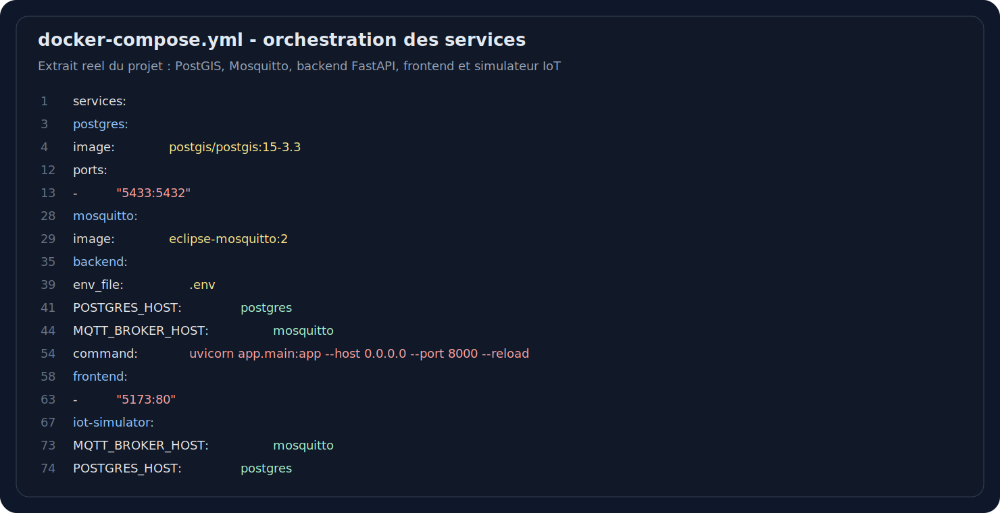

Cette capture montre la composition technique du systeme :

- PostgreSQL/PostGIS pour la persistence ;
- Mosquitto pour la messagerie MQTT ;
- backend FastAPI ;
- frontend conteneurise ;
- simulateur IoT connecte a la meme plateforme.

### Routage frontend par role

Source : [frontend/src/router/index.tsx](/Users/apple/Projects/ECOTRACK/frontend/src/router/index.tsx:27)

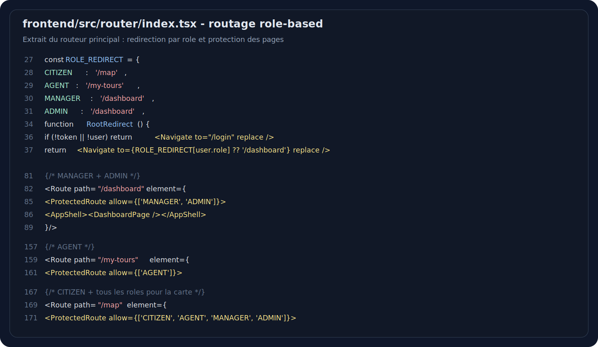

Cet extrait illustre trois decisions importantes :

- redirection automatique selon le role ;
- pages protegees par `ProtectedRoute` ;
- separation claire des espaces citoyen, agent, manager et admin.

### Endpoints d'authentification

Source : [backend/app/api/v1/auth.py](/Users/apple/Projects/ECOTRACK/backend/app/api/v1/auth.py:34)

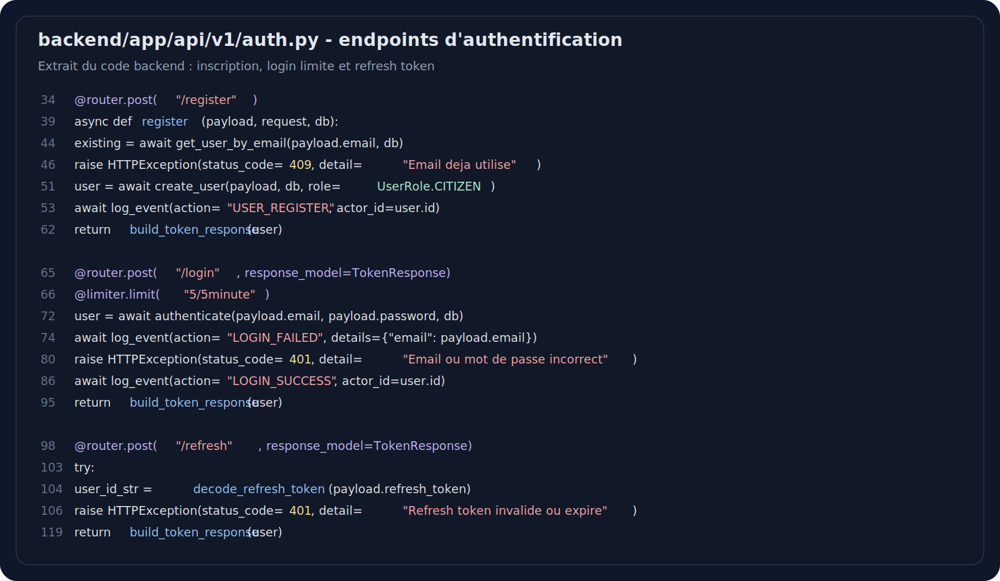

Cette capture montre que l'authentification est geree de bout en bout :

- inscription citoyen ;
- login avec limitation de tentatives ;
- journalisation des succes et echecs ;
- endpoint de refresh token.

### Securite JWT

Source : [backend/app/core/security.py](/Users/apple/Projects/ECOTRACK/backend/app/core/security.py:10)

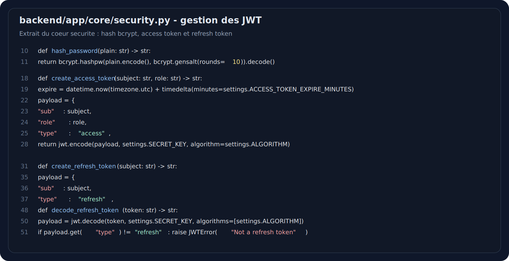

Cet extrait met en evidence :

- le hash bcrypt des mots de passe ;
- la construction des access tokens ;
- la separation access / refresh ;
- la validation explicite du type de token.

### Bootstrap backend et hardening

Source : [backend/app/main.py](/Users/apple/Projects/ECOTRACK/backend/app/main.py:24)

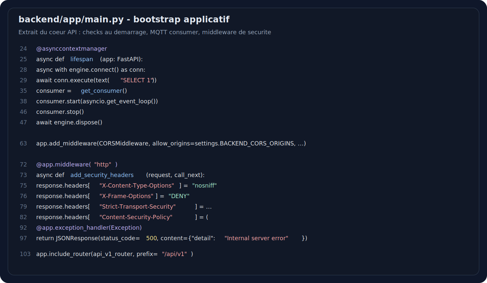

Cette vue est utile pour montrer en soutenance que le backend ne se limite pas a exposer des routes :

- verification base de donnees au demarrage ;
- demarrage du consumer MQTT ;
- middleware de securite HTTP ;
- gestionnaire global d'erreurs ;
- montage central du routeur API.

## 5.8 Documentation API exposee sur `/docs`

La documentation API est exposee localement via Swagger sur :

- `http://localhost:8000/docs#/`

Elle constitue un livrable important du projet car elle permet :

- de verifier le contrat HTTP disponible ;
- de visualiser les schemas d'entree et de sortie ;
- d'identifier les routes protegees par JWT ;
- de faciliter l'integration frontend/backend.

### Vue d'ensemble de la documentation API

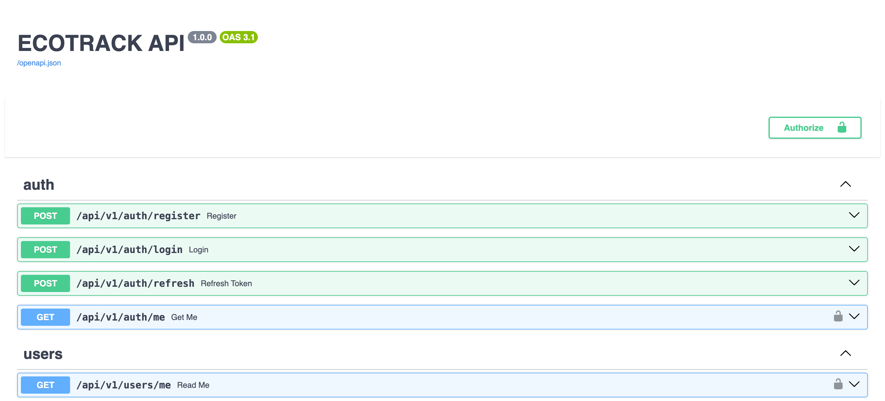

Cette vue montre que la documentation couvre l'ensemble du produit, et pas seulement l'authentification :

- endpoints de parc ;
- endpoints citoyens ;
- endpoints de tournees ;
- endpoints analytics ;
- endpoints d'administration et d'audit.

### Focus sur le tag `auth`

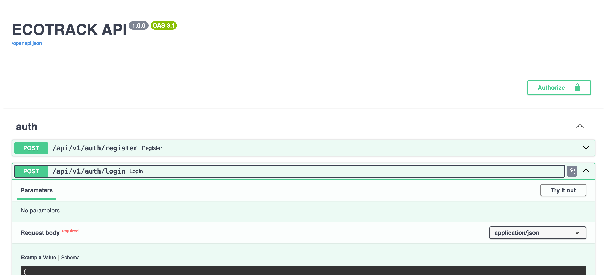

Le groupe `auth` documente clairement :

- l'inscription ;
- la connexion ;
- le renouvellement de session ;
- la recuperation du profil courant.

### Focus sur les endpoints metier

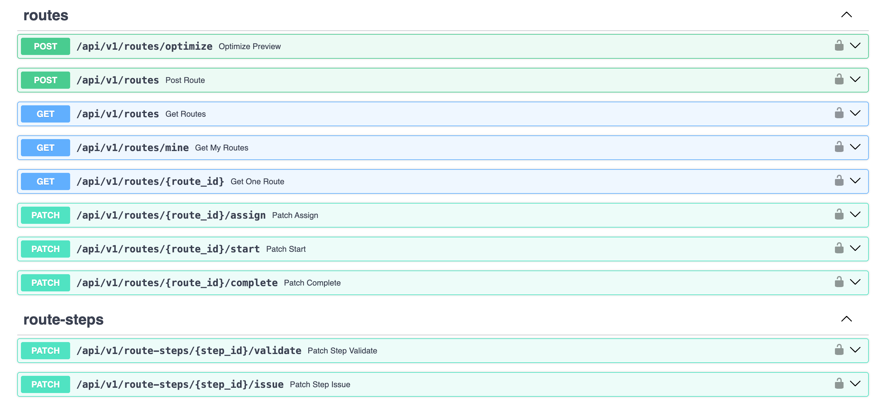

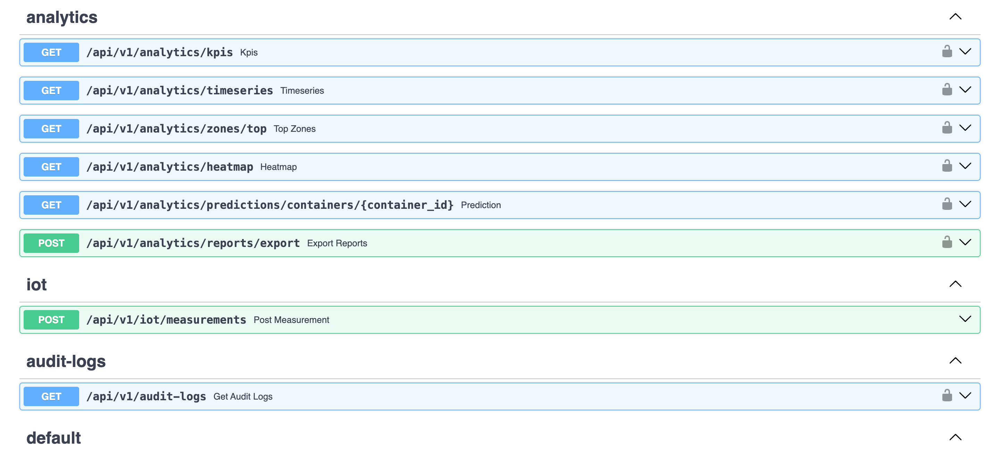

Cette vue est particulierement utile pour la soutenance car elle montre que l'API expose des capacites metier completes :

- jeu de donnees carte pour le frontend ;
- optimisation et execution de tournees ;
- endpoints analytics relies au dashboard.

---

## 6. Backlog de livraison et pilotage

## 6.1 Feuille de route projet

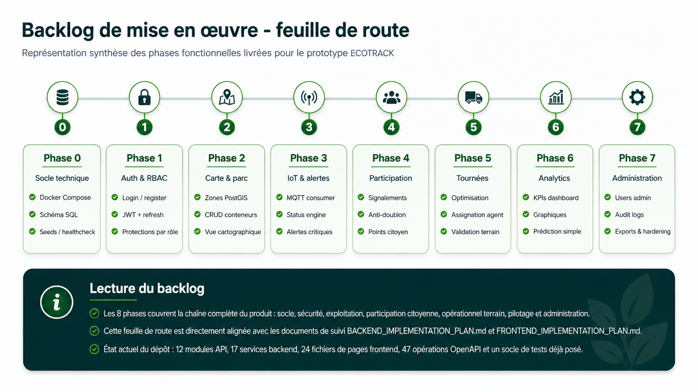

Cette roadmap reprend les 8 phases d'implementation deja documentees dans :

- `dev-docs/BACKEND_IMPLEMENTATION_PLAN.md`
- `dev-docs/FRONTEND_IMPLEMENTATION_PLAN.md`

Elle montre que le projet a ete pense par couches progressives :

1. socle technique ;
2. securisation et auth ;
3. cartographie et parc ;
4. IoT et alertes ;
5. participation citoyenne ;
6. operationnel terrain ;
7. analytics ;
8. administration.

## 6.2 Vue backlog type Kanban

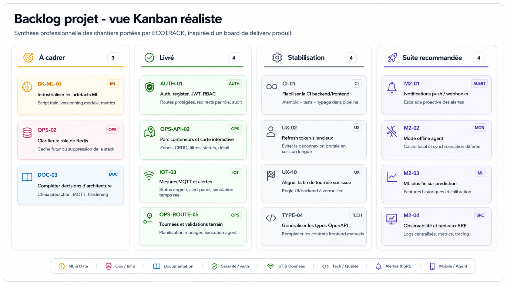

### Lecture de cette vue

- la colonne `Livre` represente le coeur du prototype effectivement en place ;
- la colonne `Stabilisation` regroupe les sujets d'alignement technique et de fiabilisation ;
- la colonne `Suite recommandee` projette les evolutions naturelles vers une version M2.

### Sujets deja fortement couverts

- auth et RBAC ;
- parc conteneurs et carte ;
- ingestion IoT ;
- signalements ;
- tournees ;
- administration ;
- documentation OpenAPI.

### Sujets restant a consolider

- typage frontend issu directement de l'OpenAPI ;
- refresh silencieux complet ;
- industrialisation CI ;
- gouvernance Redis / ML / documentation de decisions.

---

## 7. Parcours utilisateur et captures UX

> Les captures ci-dessous ont ete prises sur l'instance locale du projet en execution.  
> Elles montrent l'interface reelle, pas des maquettes fictives.

## 7.1 Ecran d'entree

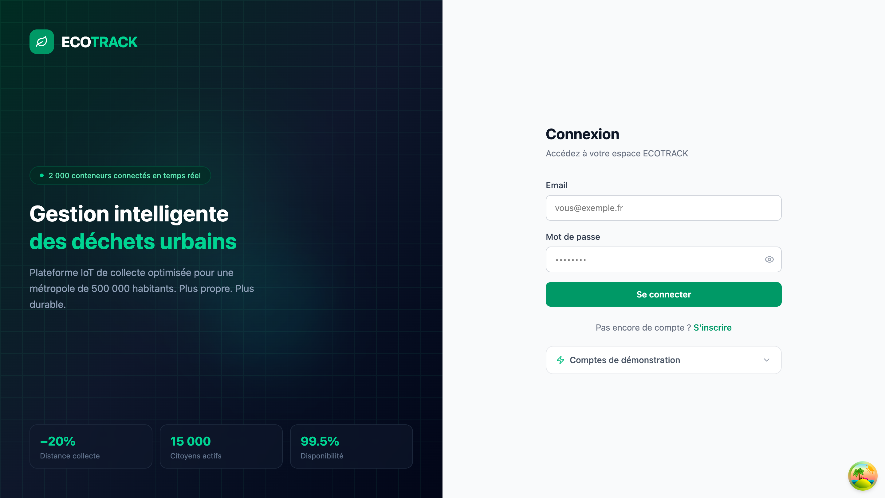

L'ecran de connexion pose deja le cadre produit :

- branding ECOTRACK ;
- promesse metier ;
- indicateurs de contexte ;
- acces aux comptes de demonstration ;
- entree unique avant redirection par role.

## 7.2 Parcours citoyen

### Carte du parc et consultation des conteneurs

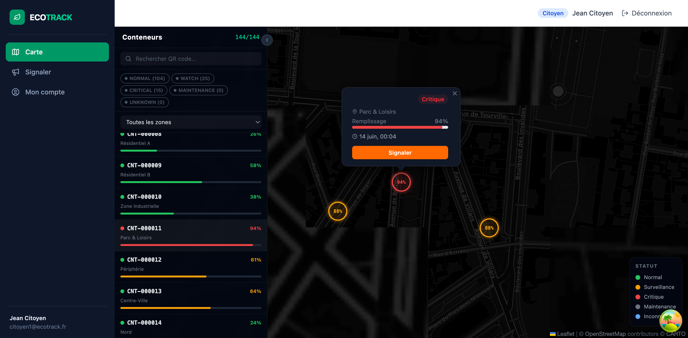

Ce qui est visible dans ce parcours :

- panneau lateral de recherche et de filtrage ;
- carte temps reel des conteneurs ;
- legende des statuts ;
- popup de conteneur critique ;
- action directe `Signaler`.

### Depot d'un signalement

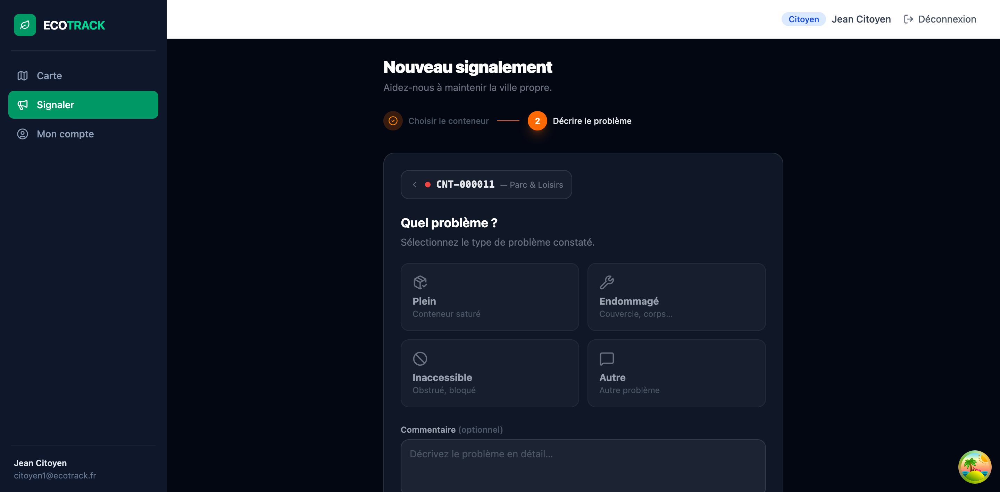

Le formulaire montre une implementation utile et concrete :

- conteneur preselectionne ;
- typologie d'incident ;
- commentaire libre ;
- logique en etapes pour guider l'utilisateur.

### Profil et gamification

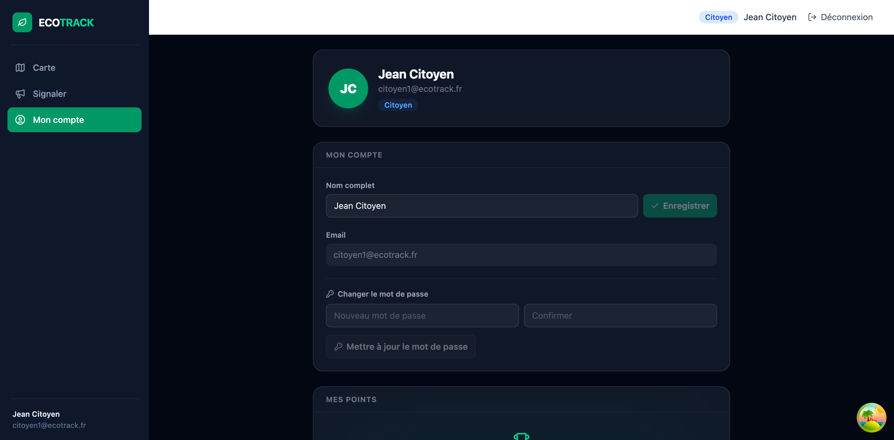

Le profil citoyen materialise :

- les informations du compte ;
- l'historique des points ;
- les signalements realises ;
- la boucle de valeur entre participation et suivi personnel.

## 7.3 Parcours agent

### Vue mobile de la tournee

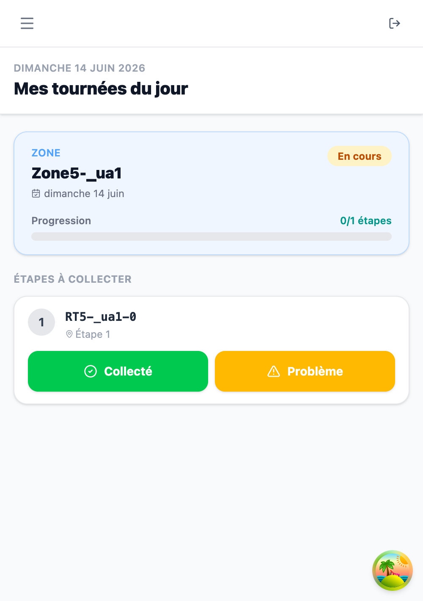

La vue agent a ete pensee pour l'usage terrain :

- date et zone de travail ;
- statut de la tournee ;
- progression ;
- actions immediates `Collecte` ou `Probleme`.

### Navigation mobile rolee

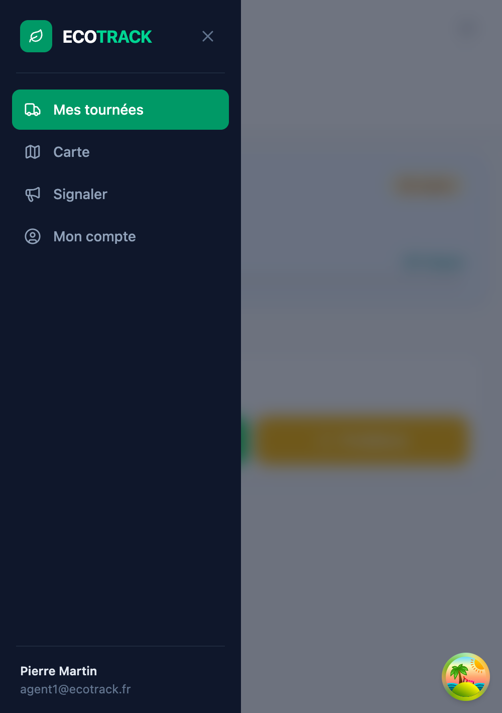

Cette capture illustre que l'agent dispose d'un espace dedie lui permettant d'acceder a :

- ses tournees ;
- la carte ;
- le signalement ;
- son compte.

## 7.4 Parcours manager

### Tableau de bord de pilotage

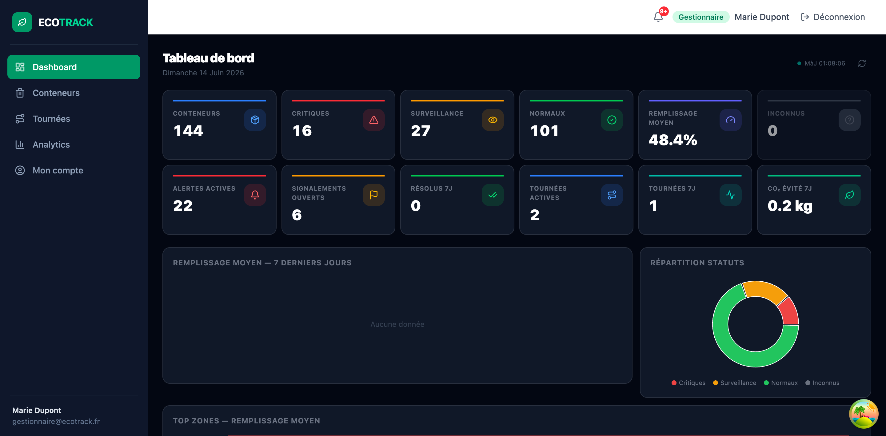

Le dashboard manager montre une implementation avancee :

- KPI operationnels ;
- compteur d'alertes ;
- suivi des signalements ;
- taux moyen de remplissage ;
- repartition des statuts ;
- visualisation des zones les plus chargees.

### Gestion des tournees

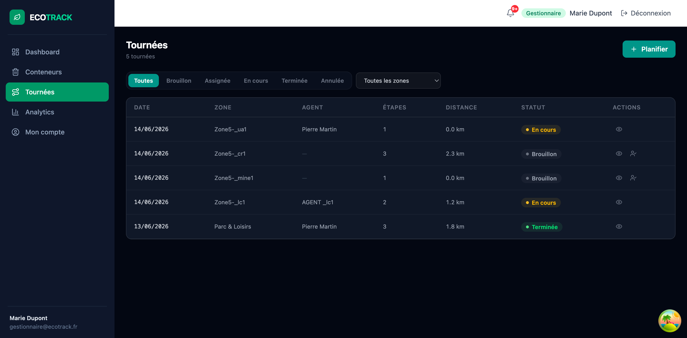

Cette vue prouve la presence d'un vrai module operationnel :

- filtre par statut ;
- lecture des distances et etapes ;
- distinction brouillon / assignee / en cours / terminee ;
- action de planification et d'assignation.

## 7.5 Parcours admin

### Administration des utilisateurs

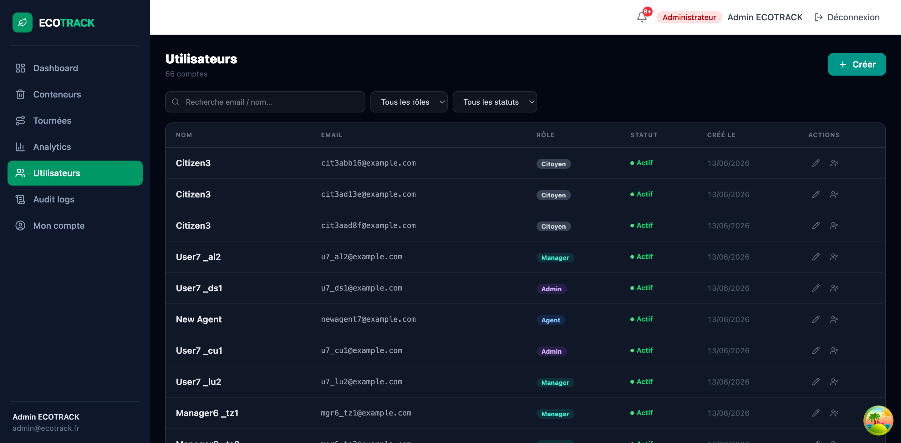

Ce module apporte :

- recherche multi-criteres ;
- filtres par role et statut ;
- creation / modification / activation ;
- gouvernance des comptes.

### Audit applicatif

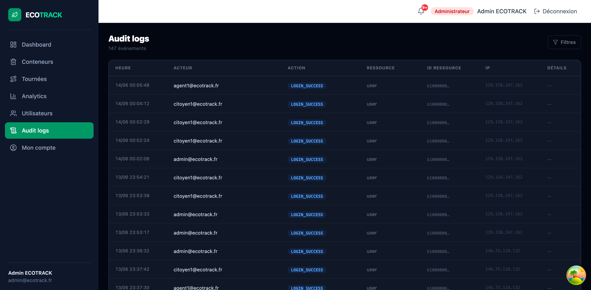

L'audit renforce la credibilite du prototype :

- historique des connexions ;
- traces des actions metier ;
- ressources impactees ;
- IP et horodatage ;
- base solide pour la redevabilite et la supervision.

---

## 8. Parcours par role - lecture fonctionnelle

| Role | Point d'entree | Actions principales | Valeur produite |
|---|---|---|---|
| Citoyen | `/map` | consulter, filtrer, signaler, suivre ses points | participation citoyenne et remontee terrain |
| Agent | `/my-tours` | demarrer, collecter, declarer un probleme | execution terrain de la collecte |
| Manager | `/dashboard` | surveiller, prioriser, planifier, analyser | pilotage quotidien du service |
| Admin | `/dashboard` puis `/admin/*` | administrer les comptes, auditer | gouvernance et tracabilite |

Cette repartition montre une vraie coherence de role :

- le citoyen agit ;
- l'agent opere ;
- le manager pilote ;
- l'admin gouverne.

---

## 9. Valeur professionnelle du livrable

Ce projet presente plusieurs qualites attendues dans un document de soutenance ou de passage en revue :

- une architecture clairement separee ;
- une implementation observable dans le code et dans l'interface ;
- une logique metier non triviale ;
- des roles differencies ;
- une integration IoT credible ;
- des visuels UX reels ;
- un backlog lisible et professionnalise ;
- une base de tests et de documentation deja en place.

---

## 10. Recommandations de finalisation avant soutenance

Les prochains gains a forte valeur sont les suivants :

1. finaliser l'usage du refresh token cote frontend ;
2. generaliser les types frontend depuis `docs/api/openapi.yaml` ;
3. fiabiliser totalement la CI avec migrations et jeux de donnees de test ;
4. formaliser les decisions d'architecture restantes ;
5. verrouiller les derniers points d'incoherence UX/backend identifies dans l'audit.

---

## 11. Conclusion

ECOTRACK n'est pas une simple base de projet. Le depot montre deja un systeme coherent, structure et demonstrable, avec une vraie chaine produit :

- donnees terrain ;
- moteur metier ;
- pilotage operationnel ;
- participation citoyenne ;
- administration et audit.

Le present document peut servir de base directe a :

- un dossier de soutenance ;
- une documentation d'implementation ;
- un support de demonstration technique ;
- une annexe de rapport de projet.
